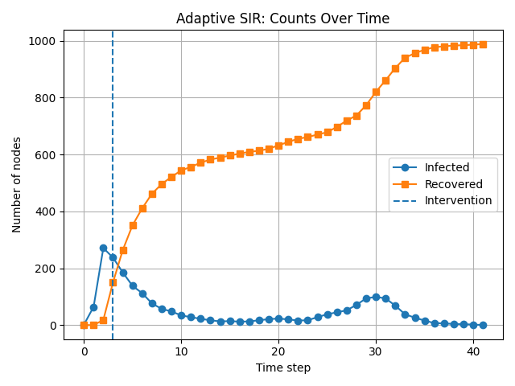
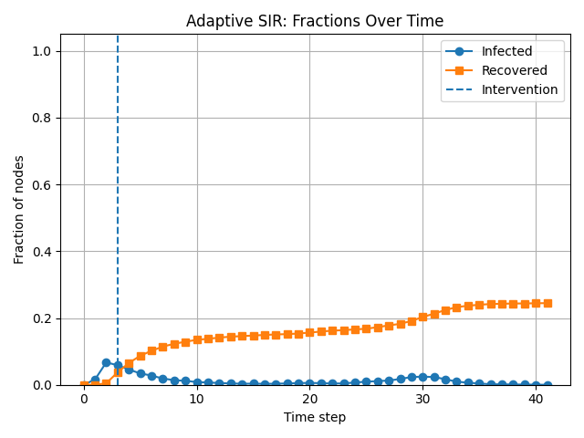
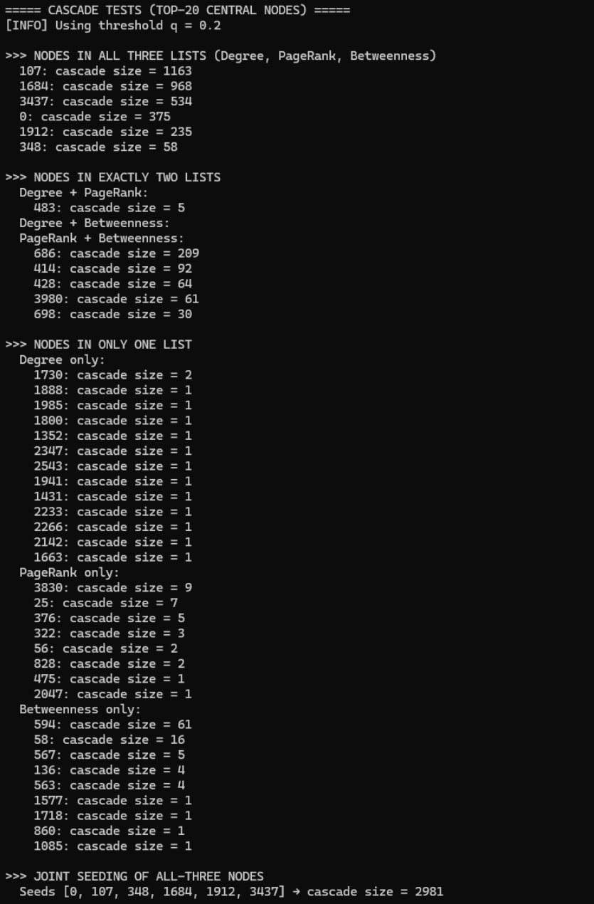
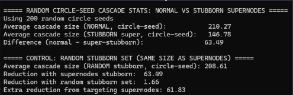
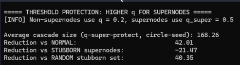
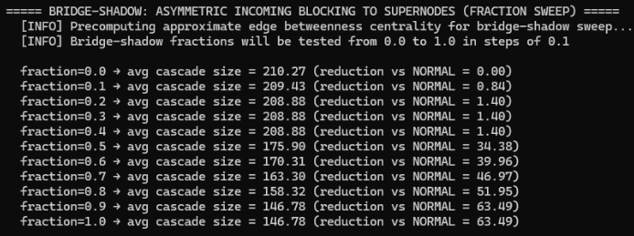

# Facebook - The Spread of Misinformation
## Phillip Tran, Christopher Bermodes, Adrienne Fernandez, Patrick Clarke, Kevin Nakadate, Mo Gibson

## Setup Instructions
This file is in python, so make sure your enviroment can run on python. If you have an old computer, we highly reccommend you use the given centrality_stats.json file and not generate it.

If you want to wait at least a couple of minutes and generate it your self:
    ./basic_stats.py

## Files
facebook.tar.gz - full dataset
facebook_combined.txt - combined dataset (used for basic stats)
centrality_stats.json - stats for all the nodes generated by basic_stats.py
basic_stats.py - gives the basic stats
cascade_super_sim.py - THIS IS THE IMPORTANT PROGRAM
sir_detect_sim.py - just for somebackground info that didnt make it into the report

## Background
While this isn't mentioned explicitly in the report because this is repeated information found in previous articles, we did use an epidemic model to simulate how ideas (including misinformation) spreads like germs. Below is the graphic to show the total number of infected nodes over time and the percentage of infected nodes across the entire network.

py sir_detect_sim.py --input facebook_combined.txt --beta 0.05 --gamma 0.30 --seed-node 107 --threshold-frac 0.05 --max-steps 200 --plot
 |

Many authors also agreed upon another common point, it is extremely important to prevent misinformation from reaching a critical point where it spreads to many people all at once. This is similiar to class discussion of a disease's critical value, and how monitoring and changing people's behaviors to keep the value below 1. This is seen in the graphics above as well.

## Sample Commad-Line Usage
These are the commands we used to get the outputs used in our report.

In order to classify what our supernodes are in this graph, we initially looked at common ways to analyze graphs (degree, pagerank, and betweenness). To do that, we used:

After testing different nodes as initial spreaders, we found that super spreaders, aka supernodes, had a high pagerank and betweenness, but degree wasn't a factor. To see all the tests done do:

python3 cascade_super_sim.py --q 0.2 --q_super 0.5 --runs 200

For "Stubborn Supernodes" (does both tests, and q value is the standard influence):

For "Forced Community Notes":

For "Shadow Blocking":

## Explaination of Approach
All the proposed solutions are influenced by what we learned in class. We found that while epidemics does show a general spread, cascades are a better example because it emphasizes the social aspect better, herd mentality and repeated exposure.

"Stubborn Supernodes" - making supernodes inherintly less likely to adopt misinformation through artificial intervention. It is impossible spread misinformation across weak ties.

"Forced Community Notes" - only allowing supernodes see posts that are cleared. This raises suspicion, but if over half (in the case of q=0.5) of their neighbors adopt, they will adopt it too. It still reduces the likelihood they can spread misinformation, just not impossible.

"Shadow Blocking" - making a supernode's posts highly subjective to algorithmic intervention because it makes misinformation less likely to show.